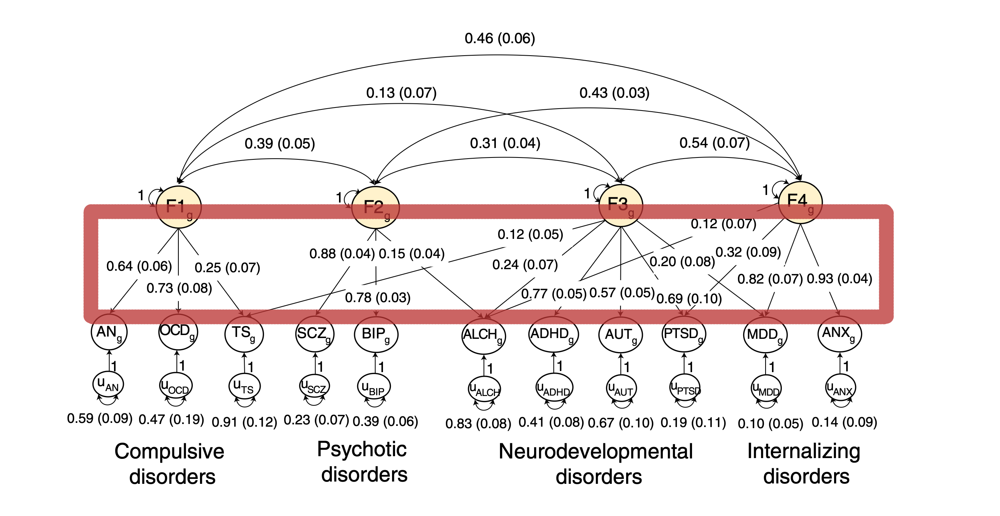

```{r setup}
#| include: false
knitr::opts_chunk$set(echo = FALSE, message = FALSE, warning = FALSE)
library(knitr)
library(ggridges)
library(ggplot2)
```


# Introduction

Classification of psychopathology

<div style="margin-top:1.25cm;"></div>
**Traditional taxonomies:** categorical diagnostic systems 
<p style="font-size:85%; text-align:left;">
(e.g., DSM, ICD)
</p>

<div style="margin-top:1cm;"></div>
**Recent models:** dimensional and transdiagnostic approaches 
<p style="font-size:85%; text-align:left;">
(e.g. Hierarchical Taxonomy of Psychopathology model by Kotov et al., 2017) 
</p>

# Research Question

How do we identify broad **factors that index shared genetic liability** within/across disorders?

- approach by Grotzinger et al. (2022): **genomic Structural Equation Modeling (genomic SEM)**
- proposed approach,  inspired by Landy et al. (2025): **Non-negative Matrix Factorization (NMF)**

# Genomic SEM

<p style="font-size:60%; text-align:left">
- GWAS summary statistics from **11 major psychiatric disorders**
</p>

<p style="font-size:60%; text-align:left">
- Estimated the **genetic covariance matrix** among disorders 
</p>

```{r image1}
#| echo: false
#| fig-align: center
#| out-width: 120%


```

<center style="font-size:40%">
(Grotzinger et al., 2022, p. 550)
</center>

<p style="font-size:60%; text-align:left">
- Modeled the matrix using a **four-factor structure**
</p>

# Proposed approach

```{r nmf}
#| echo: false
#| include: false
source("nmf.R")
```

## NMF

<p style="font-size:80%; text-align:left; line-height:1.2;">
NMF decomposes  
</p>

<center style="font-size:70%">
the full observed data matrix $\mathbf{Y} \in \mathbb{R}_{\ge 0}^{D \times N}$ of $N$ individuals $i$
</center>

<p style="font-size:80%; text-align:left; line-height:1.2;">
into two lower-rank matrices:
</p>

<center style="font-size:65%">
<span style="color:#900000;">Pattern</span> matrix (global signatures) $\mathbf{\Lambda} \in \mathbb{R}_{\ge 0}^{D \times K}$  
<span style="color:#900000;">Coefficient</span> matrix (individual contributions) $\mathbf{L} \in \mathbb{R}_{\ge 0}^{K \times N}$
</center>

<div style="margin-top:1.5cm;"></div>
<p style="font-size:80%; text-align:left; line-height:1.2;">
We assume Poisson-generated data as follows:
</p>

<p style="font-size:80%; text-align:left; line-height:1.2;">
$$
Y_{di} \sim \text{Poisson}\!\left(\sum_{k=1}^{K} \lambda_{dk} L_{ki}\right)
$$
</p>

```{r par}
#| include: true
#| echo: true 

set.seed(321)
N = 100 # number of subjects 
D = 96 # number of observed variables 
K = 4 # number of latent factors
```

## Data simulation

```{r grafico}
#| echo: false
#| message: false

grafico_datasim

```

## Estimating the latent factors

NMF used in two algorithms using the R package `causalLFO`

```{r chat}
#| include: true
#| echo: true 

all_data_fit <- all_data(M, Tr, rank = 4, reference_P = true_P)
impute_and_stabilize_fit <- impute_and_stabilize(M, Tr, rank = 4, reference_P = true_P)

impute_and_stabilize_fit$Chat[, 1:6] # showing first 6 columns

```

##

Estimate of latent factor $L_1$

```{r graficoChatL1}
#| echo: false

plot_latent_factor(1, true_C, all_data_fit, impute_and_stabilize_fit)

```

<center style="font-size:60%">
<span style="color:#900000;">red line</span> = perfect correspondence between true and estimated values
</center>

# Analytical Framework

- Use the same dataset from Grotzinger et al. (2022), the UK Biobank

- Estimate **four latent factors** ($L_1,..., L_4$) using the NMF through the Impute and Stabilize algorithm  

- Compare the identified $L_k$ with the factors obtained with the genomic SEM

# Future steps 

If the results are encouraging ...

- Estimate the **causal Average Treatment Effects (ATEs)** of multiple psychological disorders on latent outcomes derived from NMF

- **Compare ATEs** across disorders belonging to the same or different spectra to **uncover shared genetic factors**

# Materials 
All the materials are available in the `project` folder inside the following repository <a href="https://github.com/laurasitaunipd/handzone.git" target="_blank">laurasitaunipd/handzone</a>.

# Bibliography

<div style="margin-top:1cm;"></div>
<p style="font-size:70%; text-align:left; line-height:1.2;">
Grotzinger, A. D., Mallard, T. T., Akingbuwa, W. A., Ip, H. F., Adams, M. J., Lewis, C. M., ... & Nivard, M. G. (2022). Genetic architecture of 11 major psychiatric disorders at biobehavioral, functional genomic and molecular genetic levels of analysis. Nature genetics, 54(5), 548-559.
</p>

<div style="margin-top:1cm;"></div>
<p style="font-size:70%; text-align:left; line-height:1.2;">
Kotov, R., Krueger, R. F., Watson, D., Achenbach, T. M., Althoff, R. R., Bagby, R. M., ... & Zimmerman, M. (2017). The Hierarchical Taxonomy of Psychopathology (HiTOP): A dimensional alternative to traditional nosologies. Journal of abnormal psychology, 126(4), 454.
</p>

<div style="margin-top:1cm;"></div>
<p style="font-size:70%; text-align:left; line-height:1.2;">
Landy, J. M., Zorzetto, D., De Vito, R., & Parmigiani, G. (2025). Causal Inference for Latent Outcomes Learned with Factor Models. arXiv preprint arXiv:2506.20549.
</p>

# Supplemental Materials

##

Estimate of latent factor $L_2$

```{r graficoChatL2}
#| echo: false

plot_latent_factor(2, true_C, all_data_fit, impute_and_stabilize_fit)

```

<center style="font-size:60%">
<span style="color:#900000;">red line</span> = perfect correspondence between true and estimated values
</center>

##

Estimate of latent factor $L_3$

```{r graficoChatL3}
#| echo: false

plot_latent_factor(3, true_C, all_data_fit, impute_and_stabilize_fit)

```

<center style="font-size:60%">
<span style="color:#900000;">red line</span> = perfect correspondence between true and estimated values
</center>

##

Estimate of latent factor $L_4$

```{r graficoChatL4}
#| echo: false

plot_latent_factor(4, true_C, all_data_fit, impute_and_stabilize_fit)

```

<center style="font-size:60%">
<span style="color:#900000;">red line</span> = perfect correspondence between true and estimated values
</center>