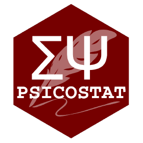

```{r setup, include=FALSE}
knitr::opts_chunk$set(echo = FALSE, message = FALSE, warning = FALSE)
library(knitr)
```

\vspace*{0.2cm}

:::::: columns
::: {.column width="25%"}
```{r logo-psicostat, out.width="100%", fig.align='center'}

```
:::

::: {.column width="50%"}
\vspace*{1.2cm}
\centering
\small \textbf{Department of General Psychology}
:::


::: {.column width="25%"}
\vspace*{0.3cm}
```{r logo_tue, out.width="90%"}
#include_graphics("images/tue2.png")
```
:::
::::::

\vspace{0.2cm}

\begin{center}
\Large
\textbf{Improving the Interpretation of Effect Sizes} \par
\textbf{through Modeling and Simulation}
\end{center}

\vspace{0.5cm}

::: {.columns}
::: {.column width="60%"}
\raggedright
\small
Supervisor: Professor Gianmarco Altoè
Co-supervisor: Professor Daniël Lakens
:::

::: {.column width="40%"}
\vspace*{1cm}

\raggedleft
\small
Candidate: Laura Sità
:::
:::

# Materials 
tutto il materiale è disponibile nella cartella `project` della repo  [laurasitaunipd/handzone.git](https://github.com/laurasitaunipd/handzone.git)